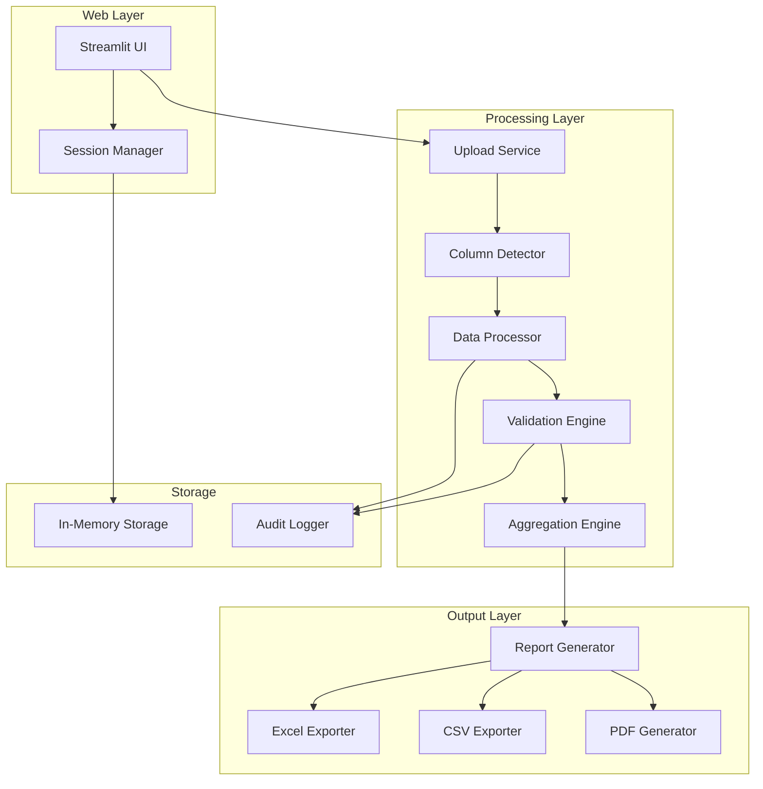
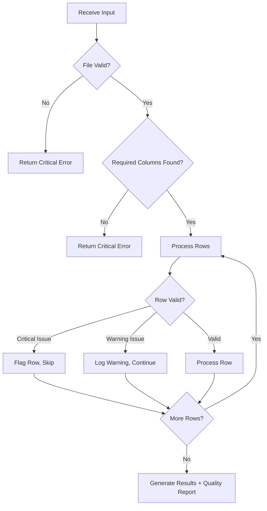

# Design Document: Cybercrime Fraud Analysis Web Application

## Overview

This document describes the technical design for a Python web application that enables law enforcement cybercrime departments to analyze fraud transaction data from Excel files. The application uses Streamlit for the web interface, pandas for data processing, and fuzzy matching for flexible column detection.

## Architecture



## Components and Interfaces

### 1. Upload Service

```python
class UploadService:
    MAX_FILE_SIZE_MB: int = 50
    ALLOWED_EXTENSIONS: List[str] = ['.xlsx', '.xls', '.csv']
    
    def validate_file(self, file: UploadedFile) -> ValidationResult:
        """Validate file type, size, and readability."""
        pass
    
    def read_file(self, file: UploadedFile) -> pd.DataFrame:
        """Read Excel/CSV file into DataFrame."""
        pass
    
    def get_preview(self, df: pd.DataFrame, rows: int = 10) -> pd.DataFrame:
        """Return first N rows for preview."""
        pass
```

### 2. Column Detector

```python
class ColumnDetector:
    SIMILARITY_THRESHOLD: float = 0.80
    
    COLUMN_VARIANTS: Dict[str, List[str]] = {
        'serial_number': ['sr no', 'sr.no', 'serial no', 's.no', 'sno', 'serial number', '#'],
        'acknowledgement_number': ['acknowledgement no', 'ack no', 'ackno', 'ack', 
                                   'acknowledgment no', 'acknowledgement number', 
                                   'acknowledgment number', 'ref no', 'reference no'],
        'bank_account_number': ['bank account no', 'bank ac no', 'bank a/c no', 'ac no', 
                                'a/c no', 'account no', 'account number', 
                                'bank account number', 'beneficiary account', 'beneficiary ac'],
        'ifsc_code': ['ifsc code', 'ifsc', 'bank code'],
        'address': ['address', 'beneficiary address', 'account holder address', 'location'],
        'amount': ['amount', 'transaction amount', 'txn amount', 'transfer amount', 'fraud amount'],
        'disputed_amount': ['disputed amount', 'disputed', 'claim amount', 
                           'disputed amt', 'chargeback amount'],
        'bank_name': ['bank name', 'bank', 'beneficiary bank', 'receiving bank']
    }
    
    def detect_columns(self, headers: List[str]) -> ColumnMapping:
        """Detect and map columns using fuzzy matching."""
        pass
    
    def calculate_similarity(self, header: str, variant: str) -> float:
        """Calculate fuzzy similarity score between header and variant."""
        pass
    
    def normalize_header(self, header: str) -> str:
        """Strip whitespace, lowercase, remove special characters."""
        pass
```

### 3. Data Processor

```python
class DataProcessor:
    def clean_dataframe(self, df: pd.DataFrame, mapping: ColumnMapping) -> pd.DataFrame:
        """Apply all cleaning operations to DataFrame."""
        pass
    
    def remove_empty_rows(self, df: pd.DataFrame) -> pd.DataFrame:
        """Remove rows where all cells are empty."""
        pass
    
    def trim_whitespace(self, df: pd.DataFrame) -> pd.DataFrame:
        """Trim whitespace from all string cells."""
        pass
    
    def standardize_account_number(self, account: str) -> str:
        """Remove spaces and dashes from account number."""
        pass
    
    def parse_amount(self, amount_str: str) -> float:
        """Convert amount string to float, handling currency symbols and commas."""
        pass
```

### 4. Validation Engine

```python
@dataclass
class ValidationResult:
    is_valid: bool
    critical_errors: List[str]
    warnings: List[str]
    flagged_rows: List[int]
    quality_report: Dict[str, Any]

class ValidationEngine:
    ACCOUNT_NUMBER_MIN_LENGTH: int = 9
    ACCOUNT_NUMBER_MAX_LENGTH: int = 18
    IFSC_CODE_LENGTH: int = 11
    
    def validate_dataframe(self, df: pd.DataFrame, mapping: ColumnMapping) -> ValidationResult:
        """Run all validations on DataFrame."""
        pass
    
    def validate_account_number(self, account: str) -> bool:
        """Check account number is 9-18 digits."""
        pass
    
    def validate_ifsc_code(self, ifsc: str) -> bool:
        """Check IFSC is exactly 11 alphanumeric characters."""
        pass
    
    def validate_amount(self, amount: float) -> bool:
        """Check amount is positive."""
        pass
    
    def check_duplicate_acknowledgements(self, df: pd.DataFrame, ack_col: str) -> List[str]:
        """Find duplicate acknowledgement numbers."""
        pass
    
    def generate_quality_report(self, df: pd.DataFrame, mapping: ColumnMapping) -> Dict:
        """Generate data quality metrics."""
        pass
```

### 5. Aggregation Engine

```python
@dataclass
class AggregatedAccount:
    account_number: str
    bank_name: str
    ifsc_code: str
    address: str
    total_transactions: int
    acknowledgement_numbers: str  # semicolon-separated
    total_amount: float
    total_disputed_amount: float
    risk_score: float

class AggregationEngine:
    def aggregate_by_account(self, df: pd.DataFrame, mapping: ColumnMapping) -> List[AggregatedAccount]:
        """Group transactions by account and calculate aggregates."""
        pass
    
    def get_most_common(self, series: pd.Series) -> str:
        """Return most common non-null value in series."""
        pass
    
    def calculate_risk_score(self, transaction_count: int, total_amount: float) -> float:
        """Calculate risk score based on transactions and amount."""
        pass
    
    def sort_results(self, accounts: List[AggregatedAccount]) -> List[AggregatedAccount]:
        """Sort by total amount desc, then by transaction count desc."""
        pass
```

### 6. Report Generator

```python
class ReportGenerator:
    def generate_excel(self, accounts: List[AggregatedAccount], filepath: str) -> None:
        """Generate summary Excel file."""
        pass
    
    def generate_csv(self, accounts: List[AggregatedAccount], filepath: str) -> None:
        """Generate summary CSV file."""
        pass
    
    def generate_pdf(self, accounts: List[AggregatedAccount], 
                     stats: ProcessingStats, filepath: str) -> None:
        """Generate PDF report with statistics and top accounts."""
        pass
    
    def generate_audit_log(self, session_info: SessionInfo, 
                          processing_result: ProcessingResult) -> str:
        """Generate audit log content."""
        pass
```

### 7. Session Manager

```python
class SessionManager:
    SESSION_TIMEOUT_MINUTES: int = 30
    
    def create_session(self) -> str:
        """Create new session with unique ID."""
        pass
    
    def validate_session(self, session_id: str) -> bool:
        """Check if session is valid and not expired."""
        pass
    
    def store_data(self, session_id: str, key: str, data: Any) -> None:
        """Store data in session (in-memory only)."""
        pass
    
    def get_data(self, session_id: str, key: str) -> Any:
        """Retrieve data from session."""
        pass
    
    def cleanup_session(self, session_id: str) -> None:
        """Delete all session data."""
        pass
    
    def check_timeout(self, session_id: str) -> bool:
        """Check if session has timed out."""
        pass
```

## Data Models

### Column Mapping

```python
@dataclass
class ColumnMapping:
    serial_number: Optional[str] = None
    acknowledgement_number: Optional[str] = None
    bank_account_number: Optional[str] = None  # Required
    ifsc_code: Optional[str] = None
    address: Optional[str] = None
    amount: Optional[str] = None  # Required
    disputed_amount: Optional[str] = None
    bank_name: Optional[str] = None
    confidence_scores: Dict[str, float] = field(default_factory=dict)
    ambiguous_mappings: Dict[str, List[str]] = field(default_factory=dict)
```

### Processing Statistics

```python
@dataclass
class ProcessingStats:
    total_input_rows: int
    rows_processed: int
    rows_with_errors: int
    unique_accounts: int
    total_fraud_amount: float
    total_disputed_amount: float
    average_amount_per_account: float
    top_accounts_by_amount: List[AggregatedAccount]
    processing_timestamp: datetime
    input_filename: str
```

### Session Info

```python
@dataclass
class SessionInfo:
    session_id: str
    created_at: datetime
    last_activity: datetime
    input_filename: Optional[str] = None
    user_id: Optional[str] = None
```

## Correctness Properties

*A property is a characteristic or behavior that should hold true across all valid executions of a system—essentially, a formal statement about what the system should do. Properties serve as the bridge between human-readable specifications and machine-verifiable correctness guarantees.*

### Property 1: File Type Validation

*For any* file upload attempt, the Upload_Service should accept the file if and only if its extension is in the allowed set (.xlsx, .xls, .csv).

**Validates: Requirements 1.1**

### Property 2: File Size Validation

*For any* file with size greater than 50MB, the Upload_Service should reject the upload. *For any* file with size less than or equal to 50MB, the Upload_Service should not reject based on size alone.

**Validates: Requirements 1.2**

### Property 3: Header Normalization Idempotence

*For any* header string, normalizing it (strip whitespace, lowercase, remove special characters) and then normalizing again should produce the same result as normalizing once.

**Validates: Requirements 2.2**

### Property 4: Fuzzy Matching Threshold Consistency

*For any* header and column variant pair, if the fuzzy similarity score is >= 80%, the Column_Detector should match them. If the score is < 80%, they should not match.

**Validates: Requirements 2.1**

### Property 5: Column Variant Recognition

*For any* known column variant from the predefined lists (serial number, acknowledgement number, bank account number, IFSC code, address, amount, disputed amount, bank name), the Column_Detector should correctly map it to the corresponding column type with 100% confidence.

**Validates: Requirements 2.6, 2.7, 2.8, 2.9, 2.10, 2.11, 2.12, 2.13**

### Property 6: Empty Row Removal

*For any* DataFrame, after processing, no row should exist where all cells are empty or null.

**Validates: Requirements 3.1**

### Property 7: Whitespace Trimming

*For any* string cell in the DataFrame, after processing, it should have no leading or trailing whitespace.

**Validates: Requirements 3.2**

### Property 8: Account Number Standardization

*For any* bank account number string, after standardization, it should contain no spaces or dashes.

**Validates: Requirements 3.3**

### Property 9: Account Number Validation

*For any* string, the Validation_Engine should mark it as a valid account number if and only if it contains between 9 and 18 digits (inclusive) after removing non-digit characters.

**Validates: Requirements 3.4**

### Property 10: IFSC Code Validation

*For any* string, the Validation_Engine should mark it as a valid IFSC code if and only if it consists of exactly 11 alphanumeric characters.

**Validates: Requirements 3.5**

### Property 11: Amount Parsing Correctness

*For any* amount string containing currency symbols (₹, $, etc.) and/or commas, parsing should produce the correct numeric value equal to the string with symbols and commas removed.

**Validates: Requirements 3.6**

### Property 12: Amount Validation

*For any* numeric amount, the Validation_Engine should mark it as valid if and only if it is a positive number (> 0).

**Validates: Requirements 3.7**

### Property 13: Critical Data Flagging

*For any* row in the DataFrame, if the bank account number or amount field is missing/null, the row should be flagged as having critical missing data.

**Validates: Requirements 3.8**

### Property 14: Duplicate Acknowledgement Detection

*For any* DataFrame where the same acknowledgement number appears more than once, the Validation_Engine should generate a warning listing the duplicates.

**Validates: Requirements 3.9**

### Property 15: Grouping Uniqueness Invariant

*For any* set of transactions, after aggregation by account number, the number of aggregated records should equal the number of unique account numbers in the input.

**Validates: Requirements 4.1**

### Property 16: Acknowledgement Number Consolidation

*For any* group of transactions with the same account number, the consolidated acknowledgement numbers string should contain all individual acknowledgement numbers from that group, separated by semicolons.

**Validates: Requirements 4.2**

### Property 17: Amount Sum Aggregation

*For any* group of transactions with the same account number, the total_amount in the aggregated record should equal the sum of all individual transaction amounts in that group. Similarly, total_disputed_amount should equal the sum of all disputed amounts.

**Validates: Requirements 4.3, 4.4**

### Property 18: Mode Aggregation for Categorical Fields

*For any* group of transactions with the same account number, the bank_name, ifsc_code, and address in the aggregated record should each be the most frequently occurring (mode) non-null value from that group.

**Validates: Requirements 4.5, 4.6, 4.7**

### Property 19: Transaction Count Accuracy

*For any* group of transactions with the same account number, the total_transactions count should equal the number of rows in that group.

**Validates: Requirements 4.8**

### Property 20: Risk Score Determinism

*For any* two aggregated accounts with identical transaction counts and total amounts, their calculated risk scores should be equal.

**Validates: Requirements 4.9**

### Property 21: Output Sorting Order

*For any* list of aggregated accounts in the output, accounts should be sorted such that for any two adjacent accounts A and B (where A comes before B): either A.total_amount > B.total_amount, or (A.total_amount == B.total_amount and A.total_transactions >= B.total_transactions).

**Validates: Requirements 5.2, 5.3**

### Property 22: Excel Export Round-Trip

*For any* list of aggregated accounts, exporting to Excel and then reading back should produce equivalent data (same account numbers, amounts, and transaction counts).

**Validates: Requirements 5.1, 5.4**

### Property 23: CSV Export Round-Trip

*For any* list of aggregated accounts, exporting to CSV and then reading back should produce equivalent data.

**Validates: Requirements 5.5**

### Property 24: Statistics Calculation Consistency

*For any* processing result, the total_fraud_amount statistic should equal the sum of total_amount across all aggregated accounts, and unique_accounts should equal the count of aggregated records.

**Validates: Requirements 6.1, 6.2, 6.3**

### Property 25: Search Filter Correctness

*For any* search query for an account number, the filtered results should contain only accounts where the account number matches or contains the search query.

**Validates: Requirements 6.6**

### Property 26: Minimum Filter Correctness

*For any* minimum transaction count filter N, the filtered results should contain only accounts where total_transactions >= N. Similarly for minimum amount filter.

**Validates: Requirements 6.7, 6.8**

### Property 27: Audit Log Completeness

*For any* processing session, the generated audit log should contain: timestamp, input filename, rows processed count, and any errors encountered.

**Validates: Requirements 9.1, 9.2, 9.3, 9.4, 9.5**

### Property 28: Error Classification Consistency

*For any* validation error, it should be classified as either Critical (missing account number column, missing amount column, unreadable file) or Warning (missing IFSC, missing address, invalid amount format, duplicate ack numbers) - never both.

**Validates: Requirements 10.1, 10.2, 10.3, 10.4, 10.5, 10.6**


## Error Handling

### Error Categories

```python
class ErrorCategory(Enum):
    CRITICAL = "critical"  # Blocks processing
    WARNING = "warning"    # Flags but continues

CRITICAL_ERRORS = {
    "NO_ACCOUNT_COLUMN": "No bank account number column found in the file",
    "NO_AMOUNT_COLUMN": "No amount column found in the file",
    "FILE_CORRUPTED": "File is corrupted or unreadable",
    "FILE_TOO_LARGE": "File exceeds maximum size limit of 50MB",
    "INVALID_FORMAT": "File format is not supported"
}

WARNING_ERRORS = {
    "MISSING_IFSC": "IFSC code missing for row {row}",
    "MISSING_ADDRESS": "Address missing for row {row}",
    "INVALID_AMOUNT": "Invalid amount format at row {row}, using 0",
    "DUPLICATE_ACK": "Duplicate acknowledgement number: {ack_no}",
    "INVALID_ACCOUNT": "Invalid account number format at row {row}",
    "INVALID_IFSC_FORMAT": "Invalid IFSC format at row {row}"
}
```

### Error Handling Flow



### Error Response Structure

```python
@dataclass
class ErrorResponse:
    category: ErrorCategory
    code: str
    message: str
    row_number: Optional[int] = None
    field_name: Optional[str] = None
    original_value: Optional[str] = None
```

## Testing Strategy

### Testing Framework

- **Unit Testing**: pytest
- **Property-Based Testing**: hypothesis
- **Test Coverage**: pytest-cov (target: 80%+ coverage)

### Dual Testing Approach

This project uses both unit tests and property-based tests:

- **Unit tests**: Verify specific examples, edge cases, and error conditions
- **Property tests**: Verify universal properties across randomly generated inputs

Both are complementary and necessary for comprehensive coverage.

### Property-Based Testing Configuration

```python
from hypothesis import given, settings, strategies as st

# Minimum 100 iterations per property test
@settings(max_examples=100)
```

Each property test must reference its design document property using the format:
```python
# Feature: fraud-analysis-app, Property N: [Property Title]
# Validates: Requirements X.Y
```

### Test Categories

#### 1. Upload Service Tests
- File type validation (Property 1)
- File size validation (Property 2)
- Corrupted file handling
- Preview generation

#### 2. Column Detector Tests
- Header normalization (Property 3)
- Fuzzy matching threshold (Property 4)
- Known variant recognition (Property 5)
- Ambiguous mapping detection

#### 3. Data Processor Tests
- Empty row removal (Property 6)
- Whitespace trimming (Property 7)
- Account number standardization (Property 8)
- Amount parsing (Property 11)

#### 4. Validation Engine Tests
- Account number validation (Property 9)
- IFSC code validation (Property 10)
- Amount validation (Property 12)
- Critical data flagging (Property 13)
- Duplicate detection (Property 14)
- Error classification (Property 28)

#### 5. Aggregation Engine Tests
- Grouping uniqueness (Property 15)
- Acknowledgement consolidation (Property 16)
- Sum aggregation (Property 17)
- Mode aggregation (Property 18)
- Transaction count (Property 19)
- Risk score calculation (Property 20)

#### 6. Report Generator Tests
- Output sorting (Property 21)
- Excel round-trip (Property 22)
- CSV round-trip (Property 23)
- Audit log completeness (Property 27)

#### 7. Dashboard/Filter Tests
- Statistics calculation (Property 24)
- Search filter (Property 25)
- Minimum filters (Property 26)

### Test Data Generators

```python
# Strategy for generating valid account numbers
valid_account_numbers = st.text(
    alphabet=st.characters(whitelist_categories=('Nd',)),
    min_size=9, max_size=18
)

# Strategy for generating valid IFSC codes
valid_ifsc_codes = st.text(
    alphabet=st.characters(whitelist_categories=('Lu', 'Nd')),
    min_size=11, max_size=11
)

# Strategy for generating transaction amounts
valid_amounts = st.floats(min_value=0.01, max_value=1e10, allow_nan=False)

# Strategy for generating transaction DataFrames
def transaction_dataframe(min_rows=1, max_rows=100):
    return st.lists(
        st.fixed_dictionaries({
            'account_number': valid_account_numbers,
            'amount': valid_amounts,
            'ifsc_code': valid_ifsc_codes,
            # ... other fields
        }),
        min_size=min_rows, max_size=max_rows
    ).map(pd.DataFrame)
```

### Integration Tests

- End-to-end file upload to report generation
- Session management and timeout
- Multi-sheet Excel handling
- Large file processing (10,000+ rows)
